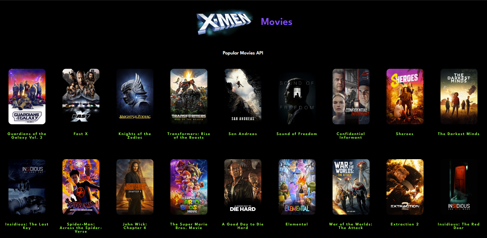
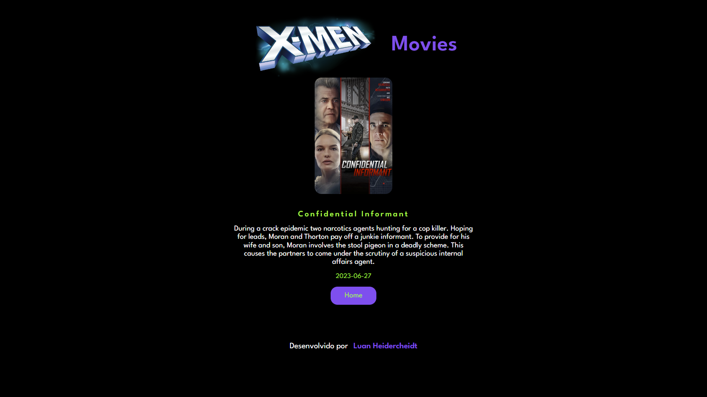

# React Movie
## Página principal

## Página de detalhes


## Por quê?
Este projeto faz parte do meu portfólio pessoal, fiz apenas com a intenção de melhorar minhas habilidades em React.js e Styled-components, então, ficarei feliz se você puder me fornecer algum feedback sobre o projeto, código, estrutura ou qualquer coisa que você pode relatar que poderia me tornar um desenvolvedor melhor!

Email: luanheider@hotmail.com

Conecte-se comigo em [LinkedIn](https://www.linkedin.com/in/luanheidercheidt/)

## Funcionalidades
- O usuário pode pode clicar no filme desejado e ler as informações sobre o filme escolhido.
## Algumas observações sobre este App.
- A API usada é a [The Movie Database API.](https://developers.themoviedb.org/3/getting-started/introduction)

## Começando
### Pré-requisitos
Para executar este projeto no modo de desenvolvimento, você precisará ter um ambiente básico para executar um React App, que pode ser encontrado[here.](https://reactjs.org/docs/getting-started.html)
### Instalando
**Clonando este repositório**
```
$ https://github.com/luanheider/react-movie
$ cd react-movie
```
**Instalando dependências**
```
$ npm install
```
_or_
```
$ yarn
```
**Running**


Com todas as dependências instaladas e o ambiente configurado corretamente, agora você pode executar o app:

```
$ npm start
```